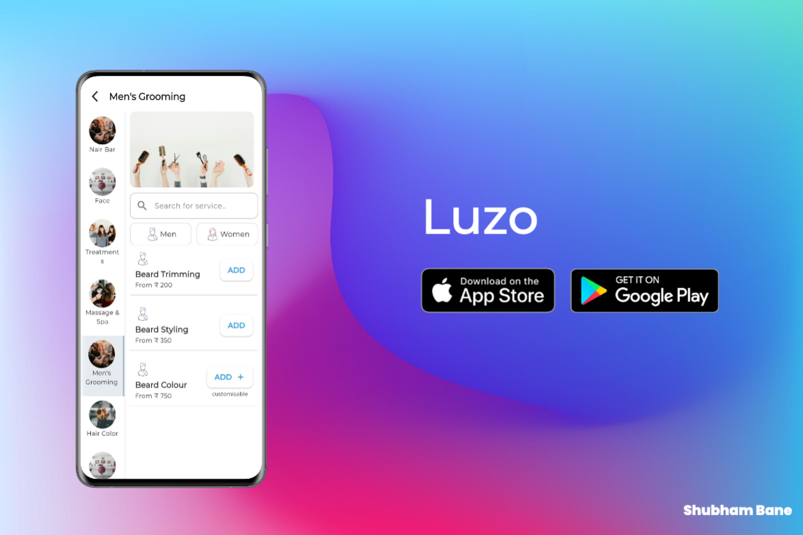

# luzo_interview

Luzo x Shubham Bane



## Project Structure
```
luzo_interview/
├── assets/
│   └── image1.png
├── lib/
│   ├── main.dart
│   ├── screens/
│   ├── widgets/
│   ├── utils/
│   └── models/
├── pubspec.yaml
└── README.md
```

## Dependencies
- device_preview: For device preview during development
- cached_network_image: For efficient image caching
- carousel_slider: For image sliders
- lottie: For Lottie animations
- google_fonts: For custom fonts

## Getting Started

This project is a starting point for a Flutter application.

A few resources to get you started if this is your first Flutter project:

- [Lab: Write your first Flutter app](https://docs.flutter.dev/get-started/codelab)
- [Cookbook: Useful Flutter samples](https://docs.flutter.dev/cookbook)

For help getting started with Flutter development, view the
[online documentation](https://docs.flutter.dev/), which offers tutorials,
samples, guidance on mobile development, and a full API reference.